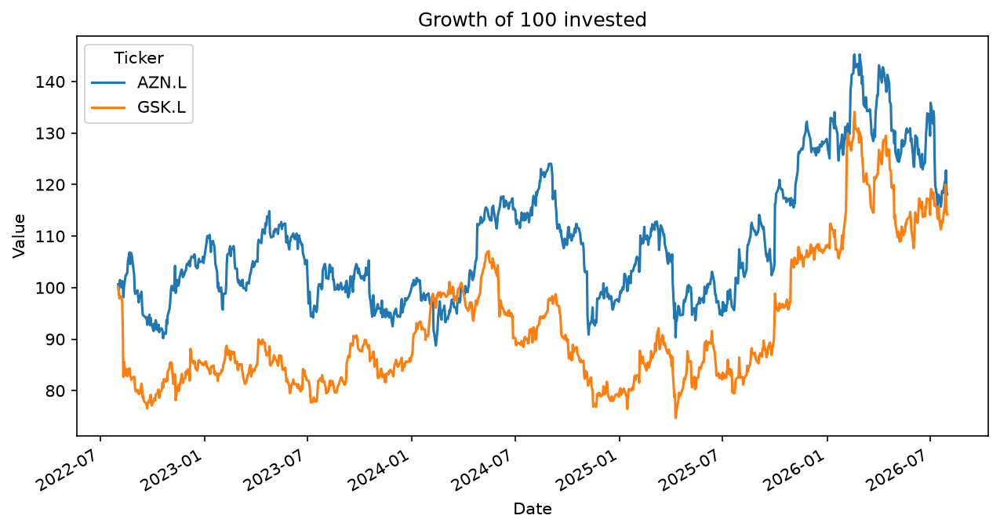

# AstraZeneca-GSK-Analysis
# AstraZeneca vs GSK: Risk and Return Analysis

**Question:** Which of AstraZeneca and GSK gave better returns relative to risk from 1st Aug 2022 - 1st Aug 2026?

**Method:** Downloaded daily adjusted prices using yfinance, calculated daily returns in pandas, and computed total return, annualised return, annualised volatility and correlation.

**Results**

| | AstraZeneca | GSK |
|---|---|---|
| Total return | [18.1]% | [14.2]% |
| Annualised return | [4.2]% | [3.4]% |
| Annualised volatility | [23.9]% | [23.5]% |

Correlation: [0.49]

**Conclusion:** Between August 2022 and August 2026, AstraZeneca returned 18.1% in total (4.2% annualised) against 14.2% (3.4%) for GSK. The two stocks had almost identical volatility (23.9% vs 23.5% annualised), so AstraZeneca's higher return gave it a slightly better return per unit of risk, at about 0.18 compared with 0.14. The correlation of 0.49 shows they moved together only moderately, which suggests holding both would offer some diversification. The analysis starts after GSK's mid-2022 Haleon demerger, which would otherwise distort its price history.

**Limitations:** Two companies over one period; past performance does not predict future returns; the return-to-volatility ratio is not a full Sharpe ratio.

**Tools:** Python, pandas, matplotlib, yfinance
